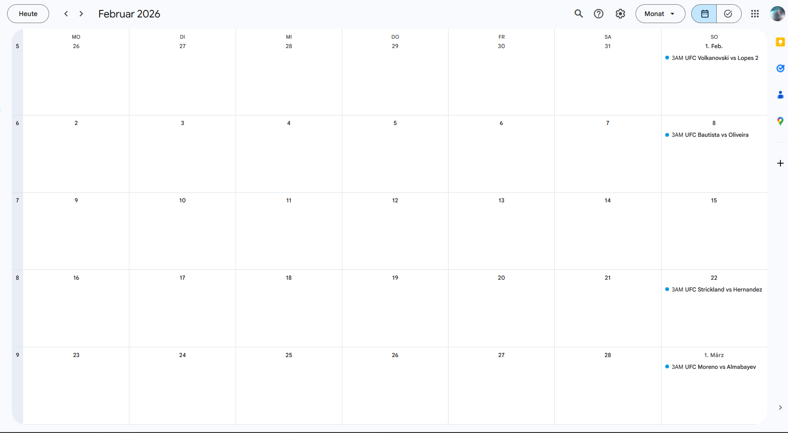

# UFC Calendar

Automatic tool to scrape upcoming UFC events and add them to Google Calendar.



We use the [gcsa](https://github.com/kuzmoyev/google-calendar-simple-api) library to write events to Google Calendar.

## Setup

1. Install dependencies:

```bash
pip install -r requirements.txt
```

2. Create Google API credentials (follow the gcsa guide):
   https://google-calendar-simple-api.readthedocs.io/en/latest/getting_started.html#credentials
   This generates `credentials.json`.

3. Run the script and authenticate (creates `token.pickle`):

```bash
python main.py
```

## Automation (GitHub Actions)

The workflow runs on the 1st of each month or manually. To add the token to GitHub:

1. Authenticate locally once:
   ```bash
   python main.py
   ```
2. Encode `token.pickle` to base64 and copy it.

PowerShell (Windows):
```powershell
[Convert]::ToBase64String([IO.File]::ReadAllBytes('token.pickle')) | Set-Clipboard
```

macOS / Linux:
```bash
base64 token.pickle | pbcopy
```

3. In GitHub: Settings → Secrets and variables → Actions → New repository secret
   - Name: `GOOGLE_TOKEN_PICKLE_BASE64`
   - Value: paste the base64 token

4. Test via Actions → Sync UFC Calendar → Run workflow